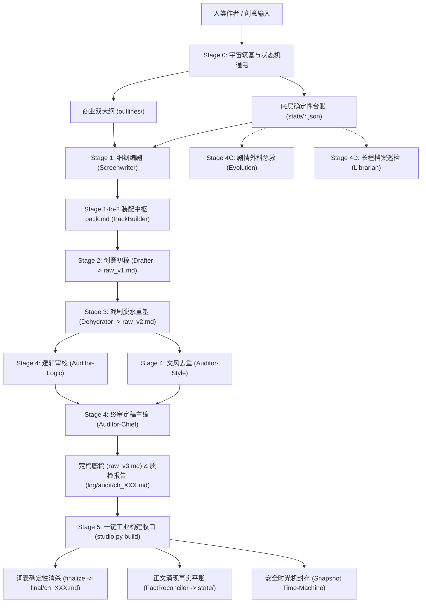

# Novel Studio 5.0 — 确定性工业长篇网文生产引擎

> **“丈量文学”** —— 将百万字商业长篇小说的长程因果、角色心智、底牌博弈与世界物理法则，沉淀为 100% 确定性的数学状态机与工业流水线。

---

## 一、 系统架构总览

Novel Studio 5.0 采用 **“确定性引擎 (Python 3.10+ 标准库) + 大模型智能体矩阵 (LLM Multi-Agent)”** 严格物理隔离的双核架构：



---

## 二、 5.0 核心突破与物理公理

### 1. 角色认知动态追踪（配角绝不降智）
- **心智四维追踪**：`current_motive`（即时动机）、`cognitive_bias`（认知偏见/盲区）、`fear_threshold`（恐惧临界点）、`want/fear`（攻防诉求）。
- **底牌调度矩阵 (TrumpCard Matrix)**：当章持有底牌、决定出牌还是保留、对读者是否公开，杜绝生死关头“遗忘技能”或强行降智。

### 2. 意图与实况双事实台账 (SSOT & Fact Emergence)
- **细纲为意图源**：规划在场人物、攻防三步阶梯、伏笔增量与底牌使用。
- **正文涌现事实自动合账**：Stage 4 提纯临场阵亡、新有名配角、新道具流转；Stage 5 `reconciler` 自动回填固化入 `state/`，杜绝已阵亡角色违规复活。

### 3. 通用泛化物理数值（零文学硬编码）
- **引擎代码纯净铁律**：Python 代码绝不包含任何题材偏见、修仙境界名或主观情感断言。
- **通用数字阶层**：位阶统一为整数 `tier_rank`，经济统一为通用 `currency_pool` 多币种记账，支持跨题材无缝迁移。

### 4. 时空时钟与宏观世界局势
- **精确时空日历**：按 `current_day` 与 `current_hour` 推进世界时间，管理昼夜、天气与位移。
- **世界时钟 (Macro World Clock)**：追踪大宗门、帝国、异族等大事件的阶段演进（`brewing` ➔ `active` ➔ `resolved`）。

### 5. 词表消杀引擎 2.0 (Lexicon Engine)
- **长词优先**：贪婪匹配最长短语，彻底避免子串误伤。
- **保护短语白名单**：成语与特定短语绝对豁免。
- **哈希幂等轮换**：同一词汇在同一章节内映射为稳定同义词，跨章节按 MD5 扰动平滑轮换。

### 6. 原子化时光机与损坏防护
- **原子落盘**：`tempfile + os.replace`，彻底避免崩溃损坏。
- **损坏文件自动隔离**：损坏 JSON 自动转储为 `*.corrupt-<timestamp>.json`。
- **严格退出码契约**：`0` (成功)、`1` (业务阻断)、`2` (参数错误)、`3` (环境异常)、`4` (存储故障)。

---

## 三、 CLI 命令行完全手册

所有命令均支持在书籍工作区根目录执行，或通过 `-w / --workspace` 指定工作区。

### 1. 新书初始化 (`init`)
```powershell
python studio.py init -t "九霄剑主" -p "萧尘" -g "玄幻脑洞" -w "workspace/jiuxiao"
```
播种工程目录、`project.json`、`state/` 八表基础数据、`bible/` 设定模板、角色与分卷大纲骨架。

### 2. 上下文按需装配 (`pack`)
```powershell
python studio.py pack ch_001 -w "workspace/jiuxiao"
```
根据 `beats/ch_001.md` 提取当章在场人物心智、底牌、时空法则、世界公理与前章末尾残局，装配自完备上下文 `pack.md`，物理屏蔽 90% 无关数据。

### 3. 正文词表消杀 (`finalize`)
```powershell
python studio.py finalize ch_001 -w "workspace/jiuxiao"
```
加载全局基线 `templates/lexicon.json` 与工作区专属覆盖词表，对起草文稿（`raw_v3.md`）进行确定性机械消杀，落盘至 `final/ch_001.md`。

### 4. 事实合账与台账封存 (`sync`)
```powershell
python studio.py sync ch_001 -w "workspace/jiuxiao"
```
提取正文涌现事实平账，更新角色生命线、底牌消耗与经济池，记录同步指纹并自动建立快照。

### 5. 一键原子收口 (`build`)
```powershell
python studio.py build ch_001 -w "workspace/jiuxiao"
```
工业级一键复合命令：`finalize` 消杀 ➔ `reconcile` 涌现平账 ➔ `apply_sync` 八表同步 ➔ `create_snapshot` 自动安全封存。

### 6. 全书合规体检 (`check`)
```powershell
python studio.py check -w "workspace/jiuxiao"
```
对全书设定槽位（`{{slot:}}`）、未登记角色、损坏文件残留等开展双核硬体检。必须保持 **0 errors** 方可放行。

### 7. 里程碑管理 (`milestone`)
```powershell
# 添加里程碑
python studio.py milestone add --title "宗门大比夺冠" --target-ch 30 --desc "萧尘力压同门夺得头名" -w "workspace/jiuxiao"

# 查看里程碑
python studio.py milestone list -w "workspace/jiuxiao"
```

### 8. 安全时光机 (`snapshot`)
```powershell
# 创建快照
python studio.py snapshot create "ch_010_before_battle" -w "workspace/jiuxiao"

# 查看快照列表
python studio.py snapshot list -w "workspace/jiuxiao"

# 一键安全回滚 (回滚前自动备份当前现场为 pre_rollback_<ts>)
python studio.py snapshot rollback "ch_010_before_battle" -w "workspace/jiuxiao"
```

### 9. 全局座舱与遥测雷达 (`cockpit`)
```powershell
python studio.py cockpit -w "workspace/jiuxiao"
```
一览全书总字数、当前章节、世界时钟（天数/小时/昼夜）、金手指能量池与过载状态、剧情线索与临期伏笔、角色健康与伤情统计。

### 10. 法定事实秒查 (`ask`)
```powershell
python studio.py ask "萧尘" -w "workspace/jiuxiao"
```
穿透检索全书 16 张底层状态表与法定事实库（P0 锁定事实、角色生理状态、道具耐久、势力外交、时钟参数），瞬时秒查。

### 11. 前瞻排产与伏笔日历 (`calendar`)
```powershell
python studio.py calendar -w "workspace/jiuxiao"
```
调取未来 3 章排产走向与临期伏笔倒计时，为 Stage 1 细纲与 Stage 2 起草提供全景前瞻视线。

### 12. 因果拓扑演进与受损半径测算 (`impact`)
```powershell
python studio.py impact C_001 -w "workspace/jiuxiao"
```
在执行剧情外科手术（Stage 4C Evolution）前，测算修改或抹除实体对全书历史章节与关联实体的波及半径（blast radius）。

### 13. 角色认知与生理长程追踪 (`trace`)
```powershell
python studio.py trace C_001 -w "workspace/jiuxiao"
```
调取指定角色的跨章节认知偏见演变、即时动机变迁、生理创伤与底牌出牌/保留历史。

### 14. 章节正文引文证据打捞 (`evidence`)
```powershell
python studio.py evidence ch_001 -w "workspace/jiuxiao"
```
自动从已定稿正文中打捞关键人物台词、道具使用原句等直接文本证据，辅助长程巡检（Librarian）补卡。

### 15. 分卷对账与换卷汇总 (`reconcile` / `rollup`)
```powershell
# 分卷对账并输出报告
python studio.py reconcile vol_01 --write -w "workspace/jiuxiao"

# 换卷就绪遥测汇总
python studio.py rollup vol_01 -w "workspace/jiuxiao"
```

### 16. 全书正文分卷聚合导出 (`export`)
```powershell
python studio.py export vol_01 -w "workspace/jiuxiao"
```
将分卷全部终审正文聚合为单体纯文本小说工件 `export/vol_01_complete.txt`。

### 17. 多章长程自动化巡航流水线 (`cruise`)
```powershell
python studio.py cruise --chapters 5 -w "workspace/jiuxiao"
```
驱动全自动化端到端推进：自动细纲骨架 ➔ 提示编剧 ➔ 自动装配 ➔ 质检审校 ➔ 自动合账封存。

---

## 四、 智能体协作技能卡矩阵 (.agents/skills)

| 阶段 | 技能标识 | 中文全称 | 核心职责 |
|---|---|---|---|
| **Stage 0-Prep** | `novel-profiler` | 故事立项与解构总监 | 解构原始 Prompt，锁定黄金锚点，输出 `dossier.md` |
| **Stage 0A** | `novel-architect-world` | 世界观与实体架构师 | 依据 dossier 填实 `bible/` 六表与 `characters/`、`entities/` 实体卡 |
| **Stage 0B** | `novel-architect-story` | 商业大纲与状态机通电 | 编制主线三幕与首卷商业大纲，通电 `state/` 八表与里程碑 |
| **Stage 0C** | `novel-architect-inspector` | 架构审查与保真核验师 | 执行机器硬闸门 (0 errors) 与大模型深度语义推演 |
| **Stage 0E** | `novel-architect-volume` | 分卷跃迁与战力防崩 | 换卷跃迁、战力二次锚定、人物地缘交接与新卷排产 |
| **Stage 1** | `novel-screenwriter` | 细纲编剧 | 编排在场角色动机、底牌、三步动作阶梯与断章刀口 |
| **Stage 2** | `novel-drafter` | 创意起草手 | 消费 `pack.md`，展开戏剧张力与实况描写，输出 `raw_v1.md` |
| **Stage 3** | `novel-dehydrator` | 戏剧脱水与重塑大师 | 彻底重写初稿，斩断注水废话与生硬转折，输出 `raw_v2.md` |
| **Stage 4** | `novel-auditor-logic` | 逻辑与因果审校官 | 审查事实冲突、伤情在场、提取涌现阵亡与新实体 |
| **Stage 4** | `novel-auditor-style` | 跨章去重与文风审校官 | 审查跨章雷同、前情回顾注水与 2026 网文反 AI 指纹 |
| **Stage 4** | `novel-auditor-chief` | 终审定稿主编 | 仲裁双轨审校报告，打磨对白与断章，输出 `raw_v3.md` |
| **Stage 4C** | `novel-evolution` | 剧情外科与死锁急救协议 | 中途改设定、因果断裂修复、沙盒安全仿真与平账 |
| **Stage 4D** | `novel-librarian` | 长程档案巡检协议 | 每 10 章长程深度巡检、角色生命线排查、卷末对账 |
| **Stage 5** | `novel-director` | 总导演与流水线调度总控 | 状态机推演调度、子代理指派与原子收口命令触发 |

---

## 五、 自动化测试套件

系统配备 100% 覆盖率的标准库自动化测试：

```powershell
# 运行全部单元测试与 E2E 冒烟测试
python -m unittest discover -s tests -p "*.py"
```

- `tests/test_storage.py`: 原子写盘、目录自愈、损坏 JSON 隔离防护。
- `tests/test_parser.py`: 纯标准库 Frontmatter 与复杂嵌套 YAML 解析。
- `tests/test_ledger.py`: 状态机加载保存、死亡角色一票否决预检、幂等合账。
- `tests/test_tracking.py`: 认知追踪、底牌矩阵、战力位阶、多币种经济、时空日历。
- `tests/test_lexicon.py`: 长词优先、保护词豁免、哈希幂等轮换、正则消杀。
- `tests/test_pipeline.py`: 上下文装配器、涌现事实提取平账、编排总控。
- `tests/e2e_smoke_test.py`: 新书立项到定稿收口的完整生命周期端到端集成测试。

---

## 六、 环境与设计哲学

- **依赖环境**：Python 3.10+（推荐 Python 3.12 / 3.14），**零第三方依赖包 (Zero Third-Party Dependencies)**。
- **设计哲学**：
  1. 文学创作属于大模型，物理事实属于确定性引擎。
  2. 意图与实况全息闭环，正文涌现事实驱动台账演进。
  3. 单步物理落盘，严禁临时脚本与无意义翻读。
